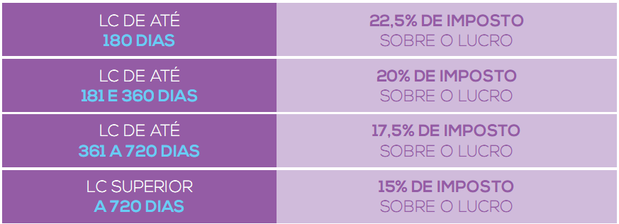

# Investimentos

Todo mundo precisa saber poupar e investir. Eis um guia prático para tal.

## Início

* É necessário saber quanto gastamos e quanto ganhamos.
* Entender que "investir" na poupança, significa perda de dinheiro devido a inflação.
* Inflação: aumento gradual dos preços do mercado -> influenciando tudo o que temos em dinheiro.
* Pela **Rentabilidade Real**, sabemos que a inflação está fazendo a gente perder dinheiro. Exemplo:
	* A poupança tem rendido cerca de 8% ao ano e a inflação ultrapassando 9% é igual: 
		(1 + 0,08) / (1 + 0,09) - 1 = -0,9% ao ano
	* COM ISSO, VOCÊ ESTÁ PERDENDO DINHEIRO!

## MERCADO FINANCEIRO

Siglas a entender:

* **IPCA**
	* Índice anual de Preços ao Consumidor
	* É elaborado pelo IBGE
	* Reflete todas as variações dos preços dos produtos e serviços que consumimos. Dessa forma, o IPCA é o indicador que o Governo Federal utiliza para verificar a famosa **inflação**!
		* Dica: se você tem algo que cobrar dos outros, você poderia fazer ao mínimo fazer com que o valor esteja vinculado ao IPCA.
* **SELIC**
	* Taxa básica de juros da economia brasileira
	* Definida pelo *COPOM* -> Comitê de Política Monetária do Banco Central do Brasil
	* Serve como base para milhares de transações e negociações.
	* **Serve para definir o "piso" do juros do país.**
	* É apartir dela que as instituições financeiras determinam remunerações, rentabilidades e referências de juros para empréstimos e financiamentos.
	* **ELA É INCRIVELMENTE INFLUENTE NA DETERMINAÇÃO DO CRÉDITO, DO CONSUMO E DA PRÓPRIA INFLAÇÃO!**
* **CDI**
	* Certificado de Depósito Bancário
	* Títulos emitidos pelos bancos com o objetivo de financiar suas próprias atividades. 
	* **COMERCIALIZADO EXCLUSIVAMENTE ENTRE OS BANCOS**
		* Com isso, um investidor como nós, não pode adquirí-lo.

**Se não podemos comprá-lo, porque o CDI é tão importante?**

Grande número das negociações diárias do mercado, seja por qualquer agente, utiliza a taxa CDI como base de cálculo dos juros que serão aplicados. Ela é um grande referencial para avaliar a rentabilidade de aplicações e investimentos. É extremamente comum ver que um título qualquer paga uma **“porcentagem do CDI”**, norteando o investidor sobre seu retorno.

## TIPOS DE INVESTIMENTOS

### Renda Fixa

Renda Fixa é um tipo de aplicação que conta com um retorno que pode ser dimensionado no momento do investimento. Desde a hora que o investidor opta por 
aplicar em um título de Renda Fixa, ele sabe quanto receberá sobre seu capital, seja o valor exato em reais ou referentes a um daqueles indexadores da economia que vimos no capítulo anterior (CDI, IPCA e Selic, por exemplo).

**Quando seu gerente de banco oferece um investimento, na maioria das vezes, se trata de um título de renda fixa. Entretanto, esse universo não para por aí: existem diversos tipos de títulos. Eles se diferem por alguns pontos que você precisa entender:**

* **EMISSOR DO TÍTULO**
	* A instituição que vende o título ao investidor;

* **TIPOS DE RENTABILIDADE**
	* Pode ser preestabelecida ou vinculada a um indexador;

* **INVESTIMENTO INICIAL MÍNIMO**
	* Existem diversos valores iniciais exigidos. Desde R$ 30 a mais de R$ 50 mil;

* **CUSTOS E TRIBUTAÇÕES**
	* Os custos variam de acordo com o título, banco, corretora, etc.

* **PRAZOS**
	* Variam de acordo com o emissor. Existem títulos de liquidez diária a investimentos com vencimento em um prazo de anos;

* **RISCO**
	* Podem ser ou não garantidos;

* **E OUTRAS DIFERENÇAS.**

O esquema de investimento é simples: você aplica uma quantia em determinado emissor e ele te retorna o título. Após o prazo acordado (ou em alguns casos até antes), você revende o título e o emissor te paga o investimento corrigido a uma taxa estabelecida ou indexador econômico:

O retorno retratado no esquema pode ser referente a uma taxa acordada no momento da compra do título **(Prefixada)**, pode estar atrelado totalmente a um indexador da economia **(Pós-fixada)** ou até retornar uma taxa combinada somada a uma variação de algum índice **(Híbrida)**.

**Tipos de investimentos de Renda Fixa**

### Risco desses investimentos?

**Não existe um investimento completamente livre de risco e sim, fatores que mitigam significativamente o risco, como o FGC.**

#### Fundo Garantidor de Créditos - FGC

O Fundo Garantidor de Créditos é uma entidade privada que existe para garantir a manutenção da estabilidade do Sistema Financeiro Nacional, isto é, ele protege o investidor afastando o país de um cenário de crise bancária.

O FGC garante investimentos de até R$ 250.000,00, por CPF e por instituição, em situações em que o emissor não consegue arcar com sua obrigação. Ele garante as principais modalidades de Renda Fixa. Nos capítulos seguintes, você conseguirá saber exatamente quais são seguradas por esse fundo e quais não são.

**Graças ao FGC, os investimentos provenientes de pequenos bancos terão a mesma garantia que os emitidos pelos bancos maiores.**

## CDB (Certificado de Depósito Bancário)

Já pegou algum empréstimo bancário ou conhece alguém que sim? Então, o banco te empresta um dinheiro e você tem a obrigação de devolver o valor somado a determinados juros. É nessa lógica que funciona.

O CDB, ou Certificado de Depósito Bancário, é como se fosse o contrário do em préstimo convencional. Ele pode ser explicado da seguinte forma:

`Uma instituição financeira pega certo recurso emprestado com você, para financiar suas próprias atividades, e te devolve o valor corrigido a uma taxa de juros estabelecida, após certo período.`

A rentabilidade dessas operações é bem interessante e é procurada por investidores que buscam segurança, estabilidade e certa liquidez de sua carteira de investimentos. Mas quanto seria necessário aplicar para desfrutar dessas características?

#### Valor mínimo

Os valores iniciais variam de **R$ 5.000,00** a mais de **R$ 50.000,00**.

#### Prazo mínimo

**Se for retirado antes do prazo, as taxas serão sucateadas e será preciso pagar multas e taxas sobre seu capital.**

**Quanto maior for o tempo que seu dinheiro ficará com o banco, melhor a taxa que ele poderá te oferecer. Essa lógica é simples: seria como se estivéssemos dando tempo e certeza ao banco para ele planejar suas próprias atividades. Desta forma, ele é capaz de retornar ao investidor um valor maior.**

#### Vencimento e Carência

**Vencimento:** refere-se a uma data combinada em que o banco tem que pagar o “empréstimo”. Nesse momento previamente combinado, o dinheiro aplicado é creditado em conta e volta para o investidor.

**Carência:** quando o CDB possui data de carência ele tem um tempo mínimo que o dinheiro deve ficar emprestado com o banco, após essa data ele retorna a ter liquidez diária. Sem o prazo de carência estipulado, é obrigatório deixar a aplicação até a sua data de vencimento.

#### Modalidades de CDB

|1. CDB PREFIXADO | 2. CDB PÓS FIXADO | 3. CDB HÍBRIDO |
|-----------------|-------------------|----------------|
|Nesta modalidade, a rentabilidade é combinada no momento da aplicação. É acordada entre o investidor e o banco uma taxa anual de retorno sobre o investimento. Esse modelo é interessante quando há previsões de recuo do valor dos juros, dessa forma o investidor aproveitaria as altas dessa taxa para investir. É comum para quem busca ainda mais certeza e estabilidade. | Este investimento caracteriza-se pelo estabelecimento de uma taxa de referência para ser usada como rentabilidade. Isto é, o banco usará uma taxa do mercado para determinar quanto sua aplicação rendeu, normalmente baseia-se na taxa Selic ou no CDI. Assim, o investidor escolhe o título e, no prazo de vencimento, descobre quanto ele rendeu de fato. Essa escolha envolve uma análise bem estruturada sobre a economia e suas respectivas previsões.| Essa modalidade pode ser entendida como a mistura das duas anteriores. É um acordo entre o banco e o investidor, em que o primeiro terá que pagar ao segundo uma taxa de rendimento preestabelecida acrescida de um valor variável. Por exemplo, fica combinado que a rentabilidade será 7% ao ano somado à inflação do período de investimento. |

**Como qualquer forma de investimento, é necessária certa análise antes de realizar aplicações em CDB. Nelas, o investidor saberá qual rentabilidade poderá conseguir sobre seu capital, qual o prazo de sua aplicação e a qual risco ele estará exposto.**

#### Riscos?

A maioria dos CDB's estão segurados pelo FGC.

#### Melhor forma de investir no CDB?

1. **Objetivo de investimento:** é aconselhável que, para qualquer investimen-
to, o primeiro passo seja sempre esse. O investidor deve saber qual será a 
sua finalidade, dessa forma fica mais fácil estipular o quanto investirá e por
quanto tempo pretende manter-se nele.

2. **Valor e melhor prazo:** como foi dito anteriormente, o valor e o prazo do
CDB determinarão sua rentabilidade. Quanto maiores os valores, melhores
as taxas oferecidas.

3. **Escolher a modalidade:** nesta fase é necessário um estudo sobre o cenário
econômico presente e suas respectivas previsões. Se você não possui essa
bagagem, é recomendado o contato com um especialista no assunto.

	a. **Quando o mercado aponta uma alta na Selic** a melhor modalidade será o **CDB Pós-fixado**, pois o investidor pegará carona nessa alta do mercado.

	b. **O cenário contrário (previsões de queda da Selic)**, aponta para um investimento em **CDB Prefixado** como melhor escolha. Como se o investidor aproveitasse as taxas altas atuais para garantir seu futuro.

	c. **Quando o cenário apresenta perspectiva de uma alta inflação**, o investidor consciente pode se aproveitar disso. O **CDB Híbrido** é recomendado para colher os melhores resultados com um futuro índice de preço elevado.

#### Vantagens e desvantagens

| Vantagens | Desvantagens |
|-----------|--------------|
| A rentabilidade do CDB pode ser até o dobro que a da poupança. | O CDB possui incidência de Imposto de Renda*. |
| O título pode ter liquidez diária, deixando seu capital livre. | No caso de resgate antes de 30 dias também há incidência de IOF.** |
| É garantido pelo FGC. | O investimento mínimo é superior ao de outros produtos como o Tesouro Direto. |
| Pode ser utilizado como margem de garantia para investir na Bolsa de Valores. | |

Você deve estar se perguntando das tributações e custos colocados acima. É bem
simples entendê-los:

O **IOF (Imposto sobre Operações Financeiras)** incidirá caso o investimento seja resgatado em menos de 30 dias, variando de 96% (operações de 1 dia) até 3% (29 dias). Após o primeiro mês a aplicação fica livre desse imposto.

O CDB também está sujeito ao **Imposto de Renda retido na fonte**, de acordo com
a tabela abaixo:

| Prazo de investimento | Alíquota sobre o ganho |
| --------------------- | ---------------------- |
| Até 180 dias | 22,5%
| Acima de 720 dias | 20%
| De 181 a 360 dias | 17,5%
| De 361 a 720 dias | 15%

#### CDB ou Poupança?

Se alguém depositou R$ 10.000 em uma caderneta de poupança qualquer, após um ano teria em conta aproximados R$ 10.800,00. Entretanto, com uma inflação anual de 9%, seria necessário, em dezembro, R$ 10.900,00 para comprar os mesmos itens que os R$ 10 mil iniciais compravam em janeiro. Dessa forma, esse investidor teve uma rentabilidade real negativa de -R$100,00.

Se ele tivesse investido esses mesmos R$ 10.000 em um CDB prefixado de 14%a.a., teria em conta, ao final de um ano, R$11.400,00 brutos, ou R$ 11.115,00 com o IR  descontado (para mais de 1 ano a taxa seria 17,5%). Dessa forma fica clara a vantagem do CDB sobre a poupança.

**Como mostra o comparativo acima, com apenas um ano de investimento em CDB é clara a diferença da rentabilidade dele para a poupança. Se o investidor prolongar o investimento, a rentabilidade e a diferença tendem a aumentar significativamente**:

Todos os cálculos de rentabilidade real foram feitos com a inflação oficial de 2015, 10,67%. A poupança não só é uma escolha pior de investimento, mas também deprecia seu capital.

**E o lugar adequado para encontrar mais opções e rentabilidade é em uma corretora de valores.**

#### CDB e Ações e Mercado Futuro

Alternativas para quem busca rendimentos maiores do que a renda fixa oferece.

Para investir nesse tipo de modalidade é necessário que o investidor tenha uma
**margem de garantia**, isto é, um valor em conta para possibilitar as operações.
Entretanto, em operações de Day Trade ou Mercado Futuro ele não precisa ter o
valor total do contrato disponível. Apenas ganhará/pagará em cima das variações
do preço.

**Mas o que isso tudo se relaciona com o nosso CDB?**

Essa margem de garantia não precisa estar em dinheiro, ela pode estar aplicada
em um título do CDB. Ou seja, o investidor que procura uma rentabilidade maior
pode aplicar em um CDB e, ao mesmo tempo, investir na Bolsa. Dessa forma ele
estará tirando proveito de dois investimentos ao mesmo tempo.

## Tesouro Direto (Títulos Públicos)

O Tesouro Direto pode ser entendido como um programa de investimento seguro
e acessível! Investidores que optam por estes papéis procuram:

* Segurança
* Liquidez
* Rentabilidade
* Praticidade

Criado pelo Governo Federal afim de obter uma fonte de financiamento para suas próprias atividades, retornando valor aos investidores corrigido a uma determinada taxa. Como se fosse um CDB destinado ao Governo Federal, você empresta dinheiro para atividades governamentais em vez de emprestar aos bancos.

**É interessante para o governo é uma ótima saída para obter financiamento e para o investidor, uma ótima oportunidade:** atravé da internet, qualquer um pode optar por um investimento seguro e que oferece lucros bem interessantes. **Ideal para quem possui um perfil de investimento mais conservador, procura simplicidade e estabilidade na sua carteira.**

#### Valor mínimo

Quem decide comprar um título não precisa pagar o preço total dele. A quantidade mínima é de 1% do papel, contanto que atinja o **valor mínimo de R$ 30,00 e o limite máximo de compra, por mês, é de R$ 1.000.000,00.**

Então, o investidor pode decidir o quanto exatamente quer investir. Com um valor
mínimo baixo, o **Tesouro não é exclusivo para investidores que já possuem grande capital! Ele é realmente um investimento para todos.**

#### O dinheiro fica preso no tesouro direto? (E a liquidez?)

Os títulos emitidos pelo Tesouro **possuem ótima liquidez**!

Quando compra um título que possui vencimento de vinte anos, por exemplo, você 
não precisa esperar todo esse tempo para resgatar seu dinheiro corrigido. O governo os recompra mesmo antes do prazo, pagando a rentabilidade correspondente ao dia de retirada e não a contratada na compra. 

**LOGO, O RESGATE ANTECIPADO NÃO SERÁ SEMPRE ALGO DESVANTAJOSO!**

Poucos sabem que esses investimentos são adequados para diferentes objetivos:
**são vantajosos no curto, médio e longo prazo**.

Os prazos combinados variam de 2 até mais de 30 anos! Então, podem encaixar-se perfeitamente aos seus planos de investimento.

**Entretanto, aquela máxima de “quanto maior o prazo e o investimento, maior será o retorno” não deixa de ser verdadeira para o Tesouro. O planejamento e o conhecimento na hora de investir são essenciais!**

Muitos investidores, por não conhecerem exatamente como o Tesouro Direto funciona, acabam optando por investimentos bem menos vantajosos.

#### Modalidades de retorno de títulos públicos

Os títulos públicos emitidos pelo Tesouro possuem diferentes rentabilidades e elas são divididas em três grupos: Prefixados, Pós-fixados e Híbridos.

|1. PREFIXADOS (Saiba sua rentabilidade) | 2. PÓS-FIXADOS (Sobe e desce da SELIC) | 3. HÍBRIDOS (Rentabilidade Mista) |
|-----------------|-------------------|----------------|
|Estes são papéis que o investidor sabe exatamente qual será sua rentabilidade. Ele saberá, no momento da compra, quanto será seu valor de face, isto é, quanto cada papel trará de retorno. Eles independem de qualquer taxa ou indexador da economia. Entre os investimentos de renda fixa, é a opção para quem tem todo o planejamento exato na ponta do lápis. | É bem simples de entender como os títulos públicos pós-fixados funcionam: os rendimentos desses papéis acompanham a movimentação da taxa Selic - a taxa de juros básica da economia brasileira. Se ela sobe, a rentabilidade também se eleva. Entretanto, o contrário também é verdadeiro. Eles são misturas das duas modalidades descritas | Uma parte de sua rentabilidade é prefixada em uma taxa acertada no mo-
mento da compra e outra acompanha algum indexador. O mais famoso de-
les acompanha a inflação (IPCA) e paga uma taxa "extra".

#### Riscos?

As chances de calote por parte do emissor dos títulos, no caso o Governo Federal, são praticamente nulas.

De acordo com relatórios do governo, o montante de títulos públicos emitidos pelo Tesouro representa menos de 1% da dívida pública federal. Dessa forma, o investidor não precisa se preocupar com os riscos dessa operação.

#### Qual título público do Tesouro posso comprar?

#### 1. Tesouro Prefixado (Antiga Letra do Tesouro Nacional (LTN))

É título prefixado, ou seja, possui taxa de retorno estabelecida no momento da compra.

É bem simples de entendê-lo: cada título comprado retornará seu valor de face, de R$ 1.000,00, para o investidor. Dessa forma, fica fácil para o investidor planejar quanto ganhará no momento de vencimento.

A rentabilidade pode ser calculada da seguinte forma: basta dividir o valor de face pelo preço unitário:

**Sobre o ganho desta operação, seria aplicada uma alíquota de 15% do Imposto de Renda (período maior que 24 meses), resultando em uma rentabilidade líquida de 30,5% do investimento. Se este mesmo valor fosse aplicado na poupança, por exemplo, alcançaria uma rentabilidade aproximada de apenas 22% no período.**

Observação sobre todos os exemplos: os valores estão sujeitos a atualização. Não deixe de visitar o site do Tesouro Nacional para saber os valores exatos.

#### 2. Tesouro Prefixado com Juros Semestrais (Antiga Nota do Tesouro Nacional Série F (NTN-F))

É um título prefixado com juros semestrais. **A única difereça aqui, é a possibilidade de retiradas semestrais. Pode ser interessante para o investidor que procura um título que possa compor sua renda.**

#### 3. Tesouro Selic (Anteriormente chamado de Letra Financeira do Tesouro (LTF))

O Tesouro Selic é o mais conhecido dos títulos pós-fixados. Isto é, o investidor não saberá exatamente quanto seu título irá render. O seu resultado, como seu nome já diz, depende da Taxa Selic.

**É o título mais adequado para os cenários que apontam que essa taxa tende a subir, uma vez que o investidor aproveita este movimento para obter melhores rendimentos.**

#### 4. Tesouro IPCA (Antiga Nota do Tesouro Nacional série B Principal (NTN-B Principal))

Possui rentabilidade atrelada ao IPCA, ou seja, ao valor de inflação. Perfeito para quem não quer perder o poder de compra. O valor será o índice de IPCA mais uma taxa de juros estabelecida no momento da compra. Dessa forma pode ser considerado um título híbrido.

Esse título é indicado quando há um cenário que aponta a alta da inflação.

**É o título mais recomendado para proteger seu investimento contra a redução do poder aquisitivo. Também é o título que proporciona ao investidor uma rentabilidade real.**

#### 5. Tesouro IPCA com Juros Semestrais (Antiga Nota do Tesouro Nacional série B (NTN-B))

A relação desse título com o Tesouro IPCA é a mesma do Tesouro Prefixado com o Tesouro Prefixado com Juros Semestrais.

Tal como o anterior, ele permite que o investidor se proteja das variações do IPCA, **entretanto recebe o fluxo de seus investimentos a cada seis meses**.

#### Como comporar um título do Tesouro

Basta ter uma conta em uma corretora habilitada que você já pode comprar seu título pela internet. Através dela você terá contato com profissionais e especialistas que estão prontos para te ajudar a optar pela melhor forma de investimento.

#### Quais são seus custos e tributos?

## LCI E LCA (Letra de Crédito Imobiliário e Letra de Crédito de Agronegócio)

São  títulos de renda fxa, emitidos por bancos e  instituições fnanceiras,  ligados a empréstimos para fnanciar algum dos dois setores (imobiliário e agronegócio). Eles possuem algumas características que costumam atrair muitos investidores:

* O que são as Letras de Crédito
* Valores e prazos de aplicações
* Custos e tributos
* E outras informações

### LCI - Letra de Crédito Imobiliário

#### Como funciona?

O título de renda fxa, como foi explicado, é emitido por uma instituição fnanceira e é lastreado por empréstimos imobiliários. Ou seja, quando alguém deseja fazer um fnanciamento em um determinado banco, a fonte desse empréstimo será o dinheiro investido por outros em letras de crédito.

**Na prática:**
Você investe seu dinheiro em uma letra de crédito imobiliário de um banco ou uma  corretora. Eles, por sua vez, emprestam esse recurso para alguma atividade de fim imobiliário, recebem esse recurso corrigido por uma taxa, e te retornam, após certo período, seu investimento acrescido por juros.

#### Risco?

É o mesmo de quase todos os outros. O seu dinheiro é emprestado para o banco, e não diretamente para o financiamento imbiliário. O seu investimento está assegurado pelo FGC.

### LCA - Letra de Crédito de Agronegócio

#### Como funciona?

Estas Letras de Crédito do Agronegócio são emitidas por bancos com o objetivo de juntar recursos a serem emprestados para empresas e produtores rurais, constituindo, desta forma, um importantíssimo agente para economia do país.
Com a emissão desses títulos, o mercado aumenta a disponibilidade de crédito para agentes de todos os setores agropecuários. Você fnancia os bancos que, por sua vez, fnanciam os produtores rurais, responsáveis por girar o mercado brasileiro: a fnalidade é sustentar atividades atreladas à produção, comercialização, benefciamento e industrialização de insumos agropecuários e de todo agronegócio. Em termos práticos, as letras de crédito são bem similares entre si.

### Tipos de rentabilidade

Tal como outros títulos de renda fxa, as Letras de Crédito estão disponíveis em diferentes modalidades: **Prefxadas, Pós-fxadas e Híbridas**.

|1. PREFIXADOS (Saiba sua rentabilidade) | 2. PÓS-FIXADOS (Sobe e desce da CDI) | 3. HÍBRIDOS (Rentabilidade Mista) |
|-----------------|-------------------|----------------|
|Se a Letra de Crédito for prefxada, isso signifca que no momento da compra o banco já disponibiliza quanto será a rentabilidade e você sabe exatamente quanto receberá no vencimento do título. Ela é atraente quando os cenários econômicos apontam que a taxa ofertada é maior que a previsão dos indexadores das outras duas modalidades. | O  título pós-fxado é sempre  indexado a alguma  taxa de  juros. As mais comuns  são as Letras de Crédito  indexadas ao CDI  - Certifcado de Depósito Interbancário. Essa taxa, geralmente, fca bem próxima à Selic - taxa de juros básica da economia - que é outro indexador (menos comum) dos títulos. Dessa forma, a rentabilidade da sua LCI ou LCA pós-fxada acompanhará as variações desses indexadores, podendo, dessa forma, oferecer retornos mais atrativos, principalmente em cenários que apontam a alta dos juros. | Para essa modalidade, os bancos retornarão ao investidor uma taxa estabelecida no momento da compra, acrescido de um valor indexado a uma taxa, como o IPCA, por exemplo.
É válido lembrar que essa modalidade é menos comum na LCA e, quando é ofertada, seu prazo será um pouco maior que as outras duas.

#### Qual investir?

Qual é melhor? Uma LCI híbrida ou uma LCA pós-fxada?

Pouco difere, em termos práticos, para o investidor investir em uma LCI ou LCA: o que determina qual será a melhor opção é o momento da compra casado com seus
próprios objetivos. As rentabilidades são analisáveis e a escolha pela melhor opção é possível com as informações certas.

Como foi dito anteriormente, o risco de crédito desses títulos é baixíssimo, o que não foi falado foi o risco de fazer a decisão errada. Quando opta por qualquer investimento, você deixa de escolher outras inúmeras opções, o risco está aí: teria algum investimento em que poderia estar ganhando mais? Quem seria a melhor pessoa para responder a essa pergunta? Um especialista, é claro! É por esse motivo que sempre recomendamos que tenha contato com um
profssional da área no momento de escolha. Evite arrependimentos!

#### Como investir de forma consciente?

#### Resumindo

Como todo investimento, a LCI e a LCA possuem prós e contras para quem deseja adquiri-las, e nós resumimos para facilitar para você. Como um investidor consciente, você deve saber todos os seguintes pontos para fazer a decisão certa.

#### Prós

* Possuem boas oportunidades de rentabilidade. Vários títulos são ofertados em diferentes  instituições fnanceiras, basta encontrar alguma com grande variedade para aproveitar as melhores taxas.
* Investimento seguro. Além de apresentar baixo risco, é garantido pelo FGC.
* **São investimentos isentos de Imposto de Renda!**

#### Contras

* Como visto anteriormente, o preço mínimo inicial de investimento das Letras de Crédito não é tão acessível. Alguns investidores desejam começar por valores menores e por isso seguem a linha do Tesouro Direto, por exemplo.
* Estes títulos, diferentemente do CDB e dos papéis emitidos pelo Tesouro, não servem como Margem de garantia para a Bolsa de Valores. Isto é, você não consegue utilizar a LCI e a LCA para investir em ações. Esse ponto é crucial para os investidores que procuram maior rentabilidade na hora que estão montando uma carteira de investimento.

#### Ressalva

## LC (Letra de Câmbio)

### O que é?

Para começar, saiba que a LC, ou Letra de Câmbio, é um exemplo de título de Renda Fixa. Eles são muito procurados por alguns detalhes.

Você já deve ter entendido como a grande maioria de títulos funciona: você, in-
vestidor,  “empresta” seu dinheiro para alguma  instituição e ela  te  retorna seu  investimento acrescido a uma determinada taxa de juros. Não é diferente para as Letras de Câmbio.

### Como funciona?

Funciona da seguinte maneira: estes títulos são emitidos por Financeiras, isto é, sociedades de crédito, investimento e fnanciamento, e assim elas podem dar segmento às suas próprias atividades. Você deve estar se perguntando o que são exatamente estas instituições. A forma mais fácil de explicá-las é dando exemplos: **Crefsa e Fininvest.**

**As Financeiras emitem as LC com a fnalidade de gerar seu próprio fnanciamento, recomprando-as a um valor maior, depois de determinado tempo.**

Muitos investidores não sabem ao certo quanto tempo necessitam permanecer com o título para eles gerarem bons retornos. Por isso, achamos válido falar a respeito dos seus prazos.

### Quanto tempo a LC leva para retornar boas taxas?

Letras de Câmbio são oferecidas sob diversas maneiras. Dessa forma, possui vários prazos diferentes: desde títulos com liquidez diária até aqueles que possuem carência atrelada ao vencimento, isto é, impossibilidade de liquidação durante certo período. Para esse investimento, não há um prazo mínimo. Entretanto, é válido lembrar que quanto maior o tempo de aplicação, maior será o retorno, seja por questões de taxas ou pela tributação, que diminui gradativamente ao longo do período (este ponto será detalhado quando explicarmos exatamente os custos do título).
Para aplicar em Letra de Câmbio, como em qualquer outra forma de inves-
timento, é exigido do investidor planejamento fnanceiro e atenção! Cremos que fcou claro que o prazo das aplicações em Letra de Câmbio não são um problema para quem opta por elas. Mas investir em uma instituição que está constantemente exposta a chances de inadimplência traz algum risco ao investidor?

### Riscos?

Mesmo que as credoras de crédito quebrem, o dinheiro é garanto pelo FGC.

### Valor mínimo

Esse é um ponto que a LC perde para alguns outros títulos de renda fxa já descritos: o capital exigido é um pouco elevado para retornar boas taxas. **De modo geral, a aplicação mínima será de R$ 30.000,00, sendo que as melhores taxas são pagas a partir de valores em torno de R$ 50.000,00**.

### Tipos de rentabilidade

Tal como outros títulos de renda fxa, as Letras de Câmbio estão disponíveis em diferentes modalidades: **Prefxadas, Pós-fxadas e Híbridas**.

|1. PREFIXADOS (Saiba sua rentabilidade) | 2. PÓS-FIXADOS (Sobe e desce da CDI) | 3. HÍBRIDOS (Rentabilidade Mista) |
|-----------------|-------------------|----------------|
|Se a Letra de Crédito for prefxada, isso signifca que no momento da compra o banco já disponibiliza quanto será a rentabilidade e você sabe exatamente quanto receberá no vencimento do título. | No momento da aplicação você não sabe ao certo a rentabilidade, é apenas uma estimativa do resgate futuro. Nesta modalidade, seu dinheiro estará vinculado a um indexador, como o famoso CDI.  | A última é, como seu nome  já mostra, uma mistura de ambas modalidades: sua rentabilidade é atrelada a um indexador, como o IPCA, somado a uma taxa estabelecida da compra do título.

**Cada uma delas é melhor para determinado cenário econômico do país e existem profssionais que trabalham exatamente para te guiar para a melhor opção. Então, na hora da decisão, não deixe de contar com um consultor.**

### Tributação

O Imposto de Renda é recolhido na fonte. Suas respectivas alíquotas seguem aquele mesmo esquema dos outros títulos de renda fxa:

### Exemplo de rentabilidade

Para entender como seria o retorno de uma Letra de Câmbio, veja o exemplo a seguir: 

Tome como parâmetro um investimento em uma LC que retorna 110% do CDI, com essa taxa a 14,13% ao ano. Supondo que aplicará um montante de R$ 30.000,00 e pretende resgatar após um ano de investimento:

O mesmo valor aplicado na poupança, seguindo uma taxa normal de 8% ao ano, traria ao investidor R$2.400,00, o que representa apenas 66% do retorno proporcionado pela LC tributado com a maior das alíquotas de IR.

---- 

Entretanto, existem ofertas de CDB no mercado fnanceiro que ultrapassam essas 
taxas, chegando até 116% do CDI. Então, antes de fazer qualquer escolha sobre 
onde irá investir, tenha certeza que estudou todas as modalidades possíveis, e 
seus respectivos prós e contras.

### Vantagens e desvantagens

Como você viu ao longo do capítulo, a Letra de Câmbio possui alguns pontos bem 
interessantes para o investidor e também algumas desvantagens. Para resumir: 

**Vantagens**

* O investimento possui baixo risco;
* Sua rentabilidade é signifcativamente maior que a da poupança;
* Possui prazos diversos, incluindo a liquidez diária;
* Está  presente  com  rentabilidades  pós  e  prefxadas,  além  da  híbrida, adequando-se ao cenário.

**Desvantagens**

* Diferentemente das LCI e LCA, ela sofre tributação de IR;
* Investimento mínimo elevado (de R$ 30 mil a R$ 50 mil);
* Pode possuir carência atrelada ao vencimento;
* Não pode ser utilizada como margem de garantia para investir na Bolsa 
de Valores.

## Debêntures

## Ações

* [Como começar a investir em ações com pouco dinheiro](https://www.youtube.com/watch?v=KsTx10ikbdc)

"`Não dá para investir sem conhecimento.`"

"`O problema é que não existe uma bala de prata para investir.`"

### Passos para investir

1 - Fundo de emergência

Antes de entrar, invista 6x o valor do seu custo mensal. Exemplo: se ganho R$ 4.000,00 líquido por mês, isso dá: 6 x 4.000 = R$ 24.000.

2 - Fundo de ações

Ao invés de escolher uma ação, invista em um fundo de ações. Exemplo:

- Você tem pouco dinheiro, por exemplo, R$ 100,00.
Mas você deixou R$ 10,00 em custo de taxas, ou seja, de 10% do seu valor.

- Você delega o seu processo decisório. O trabalho aqui, é escolher uma corretora, e dentro dessa corretora, escolher algum fundo de ações para investir.

- Quando você tem menos patrimônio, é melhor investir por taxas variáveis. Por exemplo, você vai investir R$ 100,00. Se tivermos uma taxa fixa de R$ 10,00, você irá pagar 10% do seu patrimônio. Se for uma taxa variável, de 1%, você pagaria R$ 1,00. Se fosse R$ 1.000.000, 1% seria R$ 10.000!

3 - Fundos de Índices - ETFs

**Como funciona?**

Quando a IBOVESPA subiu 10%, caiu 5%... estamos falando do índice da IBOVESPA. BOVA11

No BOVA11 você vai entender como funciona o esquema de venda, compra de ações. Ou seja, o mecanismo.

Você não está escolhendo a melhor carteira. No BOVA11, você está "investindo em todas as ações do Brasil".

O objetivo é entender o mecanismo.

Aluguel de ações. Entenda depois.

4 - Investir diretamente

SÓ VÁ PARA ESSE, DEPOIS DE PASSAR POR TODOS OS OUTROS.

"Quem entrar agora, deve olhar a longo prazo."
